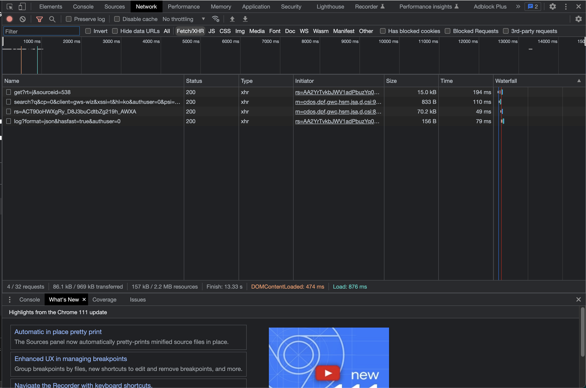

썸네일: <a href="https://unsplash.com/ko/%EC%82%AC%EC%A7%84/GqEmWxkPNa4?utm_source=unsplash&utm_medium=referral&utm_content=creditCopyText">Unsplash</a>의<a href="https://unsplash.com/de/@plhnk?utm_source=unsplash&utm_medium=referral&utm_content=creditCopyText">Paul Hanaoka</a>

출처 : [웹 성능 최적화 기법](https://link.coupang.com/a/Tasb8)

---

웹 성능 최적화 기법(루비페이퍼 사) 도서에 대한 핵심 내용과 지식을 정리한 포스트입니다.
포스트에 올라오는 내용은 도서의 일부이기 때문에 더 자세한 내용이 궁금하신 분들은 출처에서 도서를 구매해 읽어보시는 것을 추천드립니다.

---

# 1.1 웹

- 웹은 오늘날 전 세계 사람들이 인터넷에 연결된 컴퓨터를 통해 수많은 정보를 공유할 수 있는 인터넷의 대표적 서비스
    - 인터넷과 동일하게 인식되지만, 웹은 인터넷의 서비스 중 하나
    - 그 외에도 인터넷 서비스에는 이메일, 메신저, 텔넷(Telnet), FTP 등등이 있다.

### 1.1.1 웹의 역사

- 웹은 월드 와이드 웹(WWW)이라고도 하며 유럽입자물리연구소(CERN)의 연구원이던 팀 버너스 리(Tim Berners-Lee) 등이 개발한 것으로 알려져 있다.
- 이전에도 TCP/IP, UDP를 이용한 클라이언트-서버 간 네트워크 통신 또는 소켓 네트워크 기술을 사용해 데이터 교환은 가능했지만, 웹 사이트라는 페이지 기반으로 다양한 정보를 문서 형태로 제공하고, 전용 프로그램인 브라우저를 일종의 데이터 베이스로 사용할 수 있게 되었다.
- 웹은 하이퍼텍스트를 바탕으로 관련있는 문서끼리 연결한 문서의 집합체라고 할 수 있다.
    - **하이퍼텍스트**란 텍스트(문자)를 뛰어넘는 다양한 콘텐츠를 아우르는 형식

### 1.1.2 웹의 대표요소

- 웹의 대표요소 3가지는 URL, 네트워크 프로토콜, HTML이다.

**URL(Uniform Resource Locator)**

- URL은 프로토콜, 도메인, 디렉터리, 최종 경로로 이루어진다.
    - 프로토콜 : 클라이언트-서버간 데이터 통신 방식을 결정
    - 도메인 : 해당 서비스 이름을 대표
    - 디렉터리 : 자원이 위치하는 장소의 구조
    - 최종 경로 : 실제 자원이 존재하는 경로

**네트워크 프로토콜(Network Protocol)**

- **URL을 통해 알게 된 웹의 자원 위치에 접근하는 방식**
- 웹에서는 대부분 HTTP(Hypertext Transfer Protocol) 를 사용
    - HTTP는 정보를 주고받는 헤더(header)와 실제 데이터를 주고받는 페이로드(payload or body)로 나뉜다.

**HTML(HyperText Mark-up Language)**

- 다양한 웹상의 콘텐츠를 태그라는 명령어로 표현
- 실제 나타낼 데이터 정의, 페이지 문서 제목, 단락, 목록 등 구조 표현
- 웹 페이지는 HTML 외에도 클라이언트 로직을 실행할 수 있는 **JavaScript**, 레이아웃과 세부 형태를 정의하는 **CSS(Cascading Style Sheets)** 등을 같이 사용할 수 있다.

# 1.2 웹 성능이 중요한 이유

- **웹 성능(Web Performance)**이란, 콘텐츠가 신속하게 전달되어 사용자가 원하는 서비스를 빠르게 전달받을 수 있도록 하는 시스템의 성능들을 의미한다.
    - 간단히 말해 **웹 로딩 시간(web loading time)**
- 웹 성능이 좋다는 의미는 **웹 페이지 로딩이 빠르다**는 뜻
- **웹 로딩 속도**는 서비스 사용자의 이탈률과 연관성이 있으므로 이커머스 같은 서비스 업체는 매출과 직결되는 중요한 문제
    - 월마트에서는 평균 로딩 시간을 1초 줄이면 구매율이 약 2% 증가한다는 사실을 밝혔다.
    - 또한 직접 매출을 만들지 않더라도 기업 이미지와 연관성이 있다.
- 구글의 조사 자료에 따르면 페이지가 3초 안에 로딩되지 않으면 53%의 사용자가 떠나고 이탈률도 늘어난다고 하여, 3초안에 사용자의 관심을 끌어야 한다는 점에서 **3초의 법칙(3 seconds rule)**이라고도 한다.
- 기업과 엔지니어들은 콘텐츠를 유지하면서 웹 성능을 향상시키는 **웹 성능 최적화(Web Performance Optimization, WPO)**에 관심을 갖게 되었다.
    - 특히 글로벌 서비스를 지향하며 상대적으로 느린 인터넷 환경에 대비하여 웹 성능 최적화 기술이 주목받기 시작했다.

# 1.3 웹 성능 측정 방법

- 웹 성능을 측정하기 위해선 **웹 성능에 영향을 주는 요소 파악**과, **측정할 수 있는 도구 선택**이 필요하다.
    - 사용자의 경우 : 거주 지역, 네트워크 장비, 브라우저 사용환경 등
    - 공급자의 경우 : DNS 서버 응답 속도, 웹 서버 응답 속도, 백엔드 처리 속도, 프론트엔드 최적화 여부 등
    - 전달 환경 : 웹 서버가 위치한 데이터 센터의 자체 전용선 보유 여부, 각 망별 서버 배포 여부 등

## 1.3.1 크롬 브라우저의 개발자 도구

- 크롬 브라우저 실행후 `<Ctrl>+<Shift>+<I>`(MacOS의 경우 `<Cmd>+<Option>+<I>`)를 누른 후 웹사이트 접속시 전체 HTTP 요청 수, 응 수, 전달받은 콘텐츠 파일 크기, DOMContentLoaded 시간, Load 시간, 로딩 완료 시간 등을 확인할 수 있다.

- 각 콘텐츠 별로 로딩 시간을 확인할 수 있으며, 어떤 항목이 로딩을 느리게 하는지 파악하여 문제점을 해결할 수 있는 단서를 제공한다.

## 1.3.2 WebPageTest 서비스

- [WebPageTest](https://www.webpagetest.org/)(WPT)는 세계 여러 위치에서 웹 사이트 로딩 속도를 테스트할 수 있는 무료 서비스다.
- 일반적인 테스트 에이전트가 아니라 실제 유선망, 모바일망의 네트워크, 다양한 기기, 브라우저를 세계 곳곳에 설치하여 실제 사용자 환경에서 테스트할 수 있도록 꾸며 놓은 서비스이다.

## 1.3.3 구글 PageSpeed

- PageSpeed는 웹 사이트 성능 개선을 돕기 위해 구글에서 개발한 서비스이며, 웹 성능 요소 지표를 바탕으로 PageSpeed가 다양한 웹 성능 영역을 검출한다.
- PageSpeed의 여러 모듈 중 Mod_pagespeed는 Apache나 Nginx 웹 서버에 추가할 수 있는 오픈 소스 모듈로, 웹 서버에서 연동하여 성능 최적화를 돕는다.
- 또한 PageSpeed는 PSI(PageSpeed Insights) 모듈을 이용해 웹 사이트의 성능 최적화 요소를 평가하는 서비스를 제공한다.
- FCP(First Contentful Paint)와 DCL(DOM Content Loaded) 두 개 메트릭스를 사용해 특정 웹 페이지의 성능을 알려준다.
    - FCP는 웹 페이지가 사용자에게 시각적 응답을 보인 시간으로, 시간이 빠를 수록 웹 페이지가 빠르게 로딩 되었음을 알 수 있음
    - DCL은 브라우저가 HTML 문서를 로딩 및 해석하는 시간을 측정한 값으로, 이 시간이 짧아야 사용자의 체류 시간을 늘릴 수 있다.
- 최적화 상태에 대한 자세한 정보와 어떤 방법으로 개선할 수 있을지 알려주기도 한다.