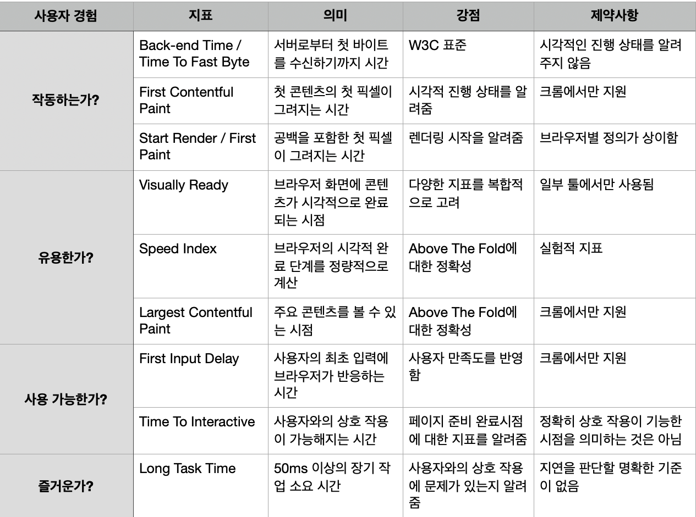

썸네일: <a href="https://unsplash.com/ko/%EC%82%AC%EC%A7%84/GqEmWxkPNa4?utm_source=unsplash&utm_medium=referral&utm_content=creditCopyText">Unsplash</a>의<a href="https://unsplash.com/de/@plhnk?utm_source=unsplash&utm_medium=referral&utm_content=creditCopyText">Paul Hanaoka</a>

출처 : [웹 성능 최적화 기법](https://link.coupang.com/a/Tasb8)

---

웹 성능 최적화 기법(루비페이퍼 사) 도서에 대한 핵심 내용과 지식을 정리한 포스트입니다.
포스트에 올라오는 내용은 도서의 일부이기 때문에 더 자세한 내용이 궁금하신 분들은 출처에서 도서를 구매해 읽어보시는 것을 추천드립니다.

---

# 5.4 도메인 분할 기법 이용하기

- **도메인 분할 기법**은 여러 도메인을 소유한 경우 웹 콘텐츠를 병렬적으로 동시에 다운로드할 수 있도록 하는 방법이다.
- 브라우저는 HTTP/1.1 프로토콜 하에서 동일 도메인에 순차적(sequential) 다운로드 방식을 사용한다.
- 브라우저는 동일 호스트명의 동시 연결 개수를 제한하며 한 도메인당 6~13개의 TCP 연결들을 동시에 생성해 여러 리소스를 한 번에 다운로드할 수 있도록 허용한다.
    - 예를 들어 6개의 동시 연결을 지원하는 브라우저에서 도메인 분할 방식을 통해 2개의 도메인을 이용하면 이론적으로 12개의 연결이 가능하다.
    - 또한 콘텐츠의 특징에 따라 도메인을 나누어 병렬로 동시 다운로드한다면 전반적인 다운로드 완료 시간을 앞당길 수 있다.
    - 사이트 전체의 쿠키 사이즈도 축소할 수 있다.
- 도메인 분할하는 방법을 할 시 주의할 점은 몇 개로 운영하는 것이 최적인지 결정하는 데는 면밀한 계획과 테스트가 필요하다.
    - 너무 많은 도메인을 추가하면 오히려 브라우저 성능을 저하시킬 수 있으므로, 하나의 웹 페이지에 포함된 리소스 개수에 따라 추가할 서브 도메인의 숫자를 결정해야 한다.
    - 브라우저 성능이 저하되는 이유는 동시 다운로드가 많을수록 CPU 리소스를 많이 사용하며, 리소스가 한계에 도달하면 오히려 다운로드 속도를 느리게 만들기 때문이다.
    - 결국 최신 컴퓨터의 CPU 파워 및 네트워크 속도, 리소스 숫자 등의 요소를 고려하여 도메인 수를 정하는 것이 바람직하다.
- 도메인 개수가 정해지면, 리소스들을 균등 분할하는 것이 권장된다.
- 리소스 분류 방법은 **리소스 성격 또는 동적으로 분류**하는 2가지 방법이 있다.
    - 리소스 성격에 따른 분류 : 자바스크립트, CSS, 폰트 같은 다양한 렌더링, 이미지, 멀티미디어 리소스들을 종류별로 구분하고 그 수를 파악해 도메인별로 균등하게 분배되도록 그룹화
    - 동적으로 도메인명 결정 : 특정 리소스에 항상 같은 도메인이 배정되도록하여 캐시 적중률을 높인다.

## 5.4.1 도메인 분할 기법과 HTTP

- 도메인 분할 기법이 고안된 이유는 HTTP/1.1의 가장 큰 문제점으로 지적되어 온 Head Of Line Blocking 현상 때문
    - HTTP/1.1에서 클라이언트는 하나의 요청을 서버에 보내고 그에 대한 정상적 응답을 받은 후에야 다음 요청을 서버에 보낼 수 있었다.
- HTTP/2에서는 멀티플렉싱 기술로 문제를 해결되어 도메인 분할 기법을 사용할 이유도 사라졌다.
- 최근 브라우저들은 TCP 연결 병합 방식을 제공을 통해 HTTP/2의 기능을 저해하지 않으면서 다중 도메인을 사용할 수 있도록 한다.
    - 첫 번째 도메인과 맺은 TCP 연결을 나머지 도메인에게 사용하는 방식
    - 사용시 주의점
        1. 브라우저가 DNS 확인 시 각 도메인은 모두 동일한 IP 주소를 반환해야 한다.
        2. 동일한 인증서를 사용해야 한다.

# 5.5 사용자 경험 개선하기

- 가장 대표적인 사용자 경험 방법은 웹 사이트 성능 개선

## 5.5.1 사용자 경험 지표 바로 알기

## 5.5.2 사용자 요청에 빠르게 반응하기

- 첫 응답속도는 마치 사람의 첫인상처럼 중요하며, 1초가 지나면 지연으로 인식하기 때문에 웹 사이트 URL을 클릭했을 때 적어도 1초 안에 반응해야 하며 2초 안에 페이지 로딩이 완료되어야 사용자 이탈을 방지할 수 있다.
- 사용자 요청에 빠르게 반응하려면 기본적으로 서버의 응답이 빨라야 한다.
    - Time To First Byte(브라우저가 서버에서 응답한 첫 번째 바이트 수신하는 기간, TTFB) 기준 300~500ms가 이상적
    - HTML 내 주석이나 공백 등 불필요한 코드를 모두 제거하여 전송되는 바이트 크기를 줄인다.
    - HTML 페이지를 캐시하여 서버 처리 시간을 최소화하기

### 브라우저 렌더링을 빠르게 하기 위한 최적화 기법들

1. CSS, 자바스크립트 파일들 크기 줄이기
- 공백과 주석을 제거하는 것도 유효하지만, 렌더링 페이지에 필요한 부분만 남기고 모두 지우는 방법이 확실
- 크롬 브라우저의 [도구 더보기] → [개발자 도구] → [Customize and control DevTools] → [More tools] → [Coverage] 모듈을 사용해 페이지에서 실제 사용되는 코드를 확인하여 코드 분리 작업 진행

1. CSS, 자바스크립트들을 중요 리소스와 그렇지 않은 리소스로 분류
- 화면 안쪽(above the fold)의 웹 콘텐츠를 렌더링하기 위한 파일들이 중요 리소스에 속함
- 화면 바깥쪽(below the fold)의 콘텐츠를 렌더링하기 위한 파일, 부가적 기능들을 수행하는 스크립트 파일 등을 중요하지 않은 리소스로 분류

1. 2번에서 분류된 중요 리소스들은 가능한 빠르게 로딩시키기 
- 리소스 힌트 preload 사용하기
- HTTP/2 서버 푸시 활용하기 (HTML이 다운로드되는 시점에 이뤄짐)

1. 중요하지 않은 리소스들은 나중에 로딩시키기
- async, defer 속성 사용하기
- onLoad 이벤트 이후 수행하도록 하기

## 5.5.3 사용자 시선 붙잡기

- 사용자가 이탈하지 않도록 시선을 붙잡기 위해선 Hero 이미지가 가장 빠르게 화면에 로딩돼야 한다.
- Hero 이미지가 늦게 로딩되는 주된 이유는 페이지 로딩 시간을 개선하기 위해 모든 이미지들을 일괄적으로 지연 로딩시키기 때문
    - 이미지 지연 로딩은 Hero 이미지들을 제외한 나머지 이미지들에 적용해야 한다.
- 또다른 이유는 CSS의 background-image 속성으로 지정되었을 경우가 있다.
    - CSS background-image 속성으로 지정된 이미지들은 CSS가 분석되고 DOM에 적용될 때 다운로드되고, 프리로더에도 적용되지 않아 늦게 다운로드 된다.
    - 이를 해결하기 위해서 아래 3가지 규칙을 지킬것이 권장된다.
        1. HTML  태그나 <picture> 태그를 사용하여 직접 다운로드하고 지연 로딩을 적용하지 않는다.
        2. CSS background-image 속성에 Hero 이미지를 사용하지 않는다.
        3. CSS 배경 이미지로 Hero 이미지를 꼭 사용해야 한다면 리소스 힌트인 preload를 사용해 일찍이 다운받는다.
- 메인 텍스트는 의미 있는 콘텐츠를 구성하므로, 핵심 메시지를 빠르게 나타내기 위해선 폰트를 빨리 다운로드 해야 한다.
    - 폰트는 CSS의 font-face를 통해 로딩되므로 일반적 이미지들보다 다운로드 시작 시점이 늦으므로 리소스 힌트인 preload를 사용하여 필요한 폰트를 일찌감치 다운로드하는 것이 권장됨
    - 한글 폰트는 용량이 큰 편이므로 파일 경량화가 선행되어야 한다.
- 폰트 로딩 방식도 폰트 다운로드 속도에 영향을 주기 때문에 고려할 필요가 있다.
    - Flash Of Invisible Text(FOIT) : 웹 폰트를 완전히 다운로드한 후 텍스트를 나타내는 방식
    - Flash Of Unstyled Text(FOUT) : 시스템 폰트를 먼저 사용 후 웹 폰트가 다운로드되면 대체하는 방식
    - 크롬 브라우저는 FOIT, FOUT을 혼합해서 사용하지만 사용자 경험을 고려할 때는 FOIT 보다는 FOUT 방식을 사용해 가능한 빠르게 사용자 메시지를 전달하는 것이 바람직하다.
    - FOUT는 CSS font-face 룰에서 font-display 속성을 swap으로 변경하여 사용할 수 있다.

## 5.5.4 사용자 상호 작용 방해하지 않기

- Time To Interactive 지표는 CPU 유휴 시간, 네트워크 사용량 등 클라이언트의 지표에 의해 결정되므로 다운로드 리소스 양과 수행 스크립트를 줄이는 것이 가장 중요하다.
    - 이 중 서드파티 리소스는 최적화하기 어렵기 때문에 도입 전 성능 검증, 도입 후 점검, 사용 완료 후 제거 작업등을 필요로 한다.
    - 서드파티 리소스가 웹 사이트 성능에 영향을 주지 않게 하기 위해선 비동기적으로 다운로드 되어야함
    - [SPOF-O-Matic](https://chrome-stats.com/d/plikhggfbplemddobondkeogomgoodeg)을 통해 잠재적 장애 요소 여부를 판단할 수 있다.