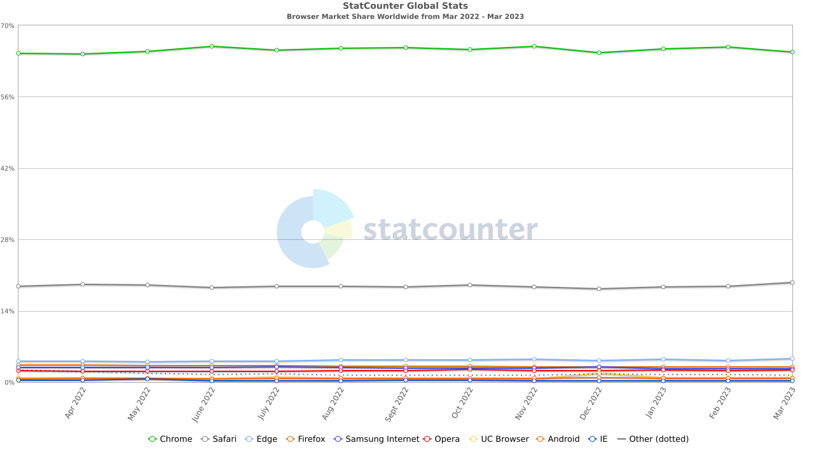
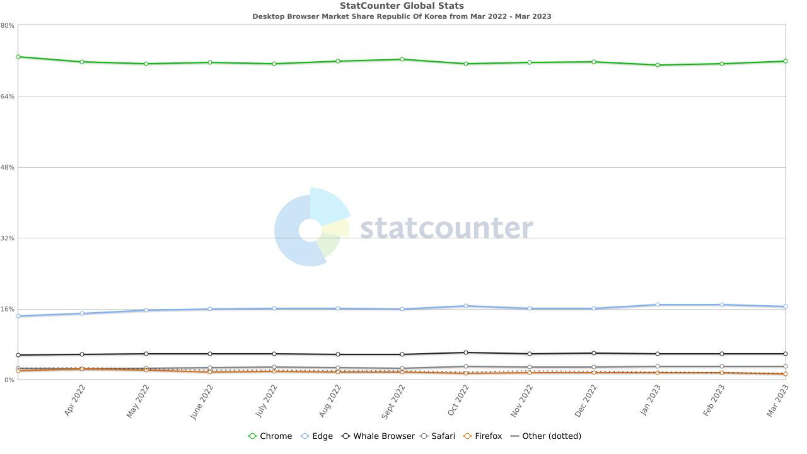
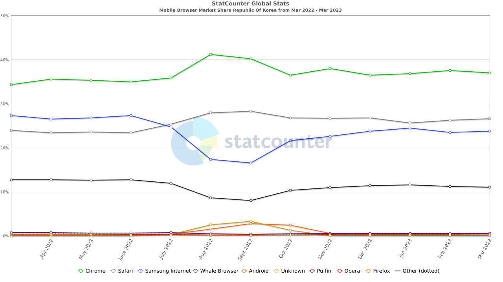
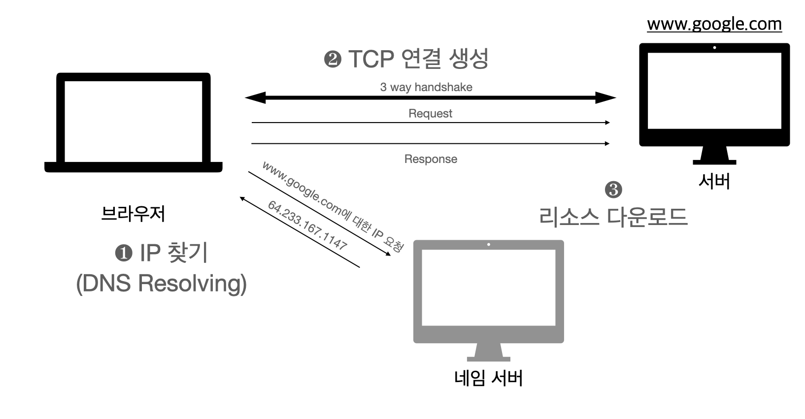

썸네일: <a href="https://unsplash.com/ko/%EC%82%AC%EC%A7%84/GqEmWxkPNa4?utm_source=unsplash&utm_medium=referral&utm_content=creditCopyText">Unsplash</a>의<a href="https://unsplash.com/de/@plhnk?utm_source=unsplash&utm_medium=referral&utm_content=creditCopyText">Paul Hanaoka</a>

출처 : [웹 성능 최적화 기법](https://link.coupang.com/a/Tasb8)

---

웹 성능 최적화 기법(루비페이퍼 사) 도서에 대한 핵심 내용과 지식을 정리한 포스트입니다.
포스트에 올라오는 내용은 도서의 일부이기 때문에 더 자세한 내용이 궁금하신 분들은 출처에서 도서를 구매해 읽어보시는 것을 추천드립니다.

---

# 5.1 웹 브라우저 현황 알아보기

- 웹 페이지를 경량화 하더라도 결국 HTML을 화면에 그리는 것은 웹 브라우저이므로, 브라우저가 페이지를 화면에 렌더링하는 방식을 이해하고 이를 최적화하느 것이 프론트엔드 최적화의 핵심이다.

- 브라우저 점유율 통계를 살펴보면 1위는 데스크탑, 모바일 모두 Chrome 브라우저가 차지하고 있으며, 데스크톱 2,3위는 사파리와 파이어폭스, 모바일은 사파리, 삼성 인터넷이 각 2,3위를 차지하고 있다.

- 국내 데스크탑 브라우저 점유율은 1위 Chrome(약 72%), 2위 Edge(약 17%)로 양분되며 나머지는 Whale, Safari, Firefox 순으로 작은 점유율을 가져가고 있다.

- 국내 모바일 브라우저 점유율은 1위 Chrome(약 37%), 2위 Safari (약 27%), 3위 삼성 인터넷(약 23.77%) 4위 Whale(약 11%)로 데스크탑보다는 다양한 브라우저가 사용되는 것을 알 수 있다.

- 이런 브라우저별로 지원하는 이미지 타입이 서로 다르기 때문에 사이트의 타겟을 설정할 때 점유율이 높은 브라우저에 대한 이미지를 별도로 준비하는 것이 효율적이다.

# 5.2 웹 브라우저 동작 이해하기

- 사용자가 입력창에 접속하고자 하는 웹 사이트 주소를 입력하면 브라우저의 동작이 시작된다.

❶ 브라우저는 가장 도메인 서버와 통신하여 접속하려는 호스트의 IP를 찾는다.

❷ 해당 IP를 가진 서버와 통신을 시도해 TCP 연결을 맺는다. (**HTTPS에선 암호화된 연결을 생성하려는 협의 단계가 더 추가됨**)

❸ 이후 연결이 맺어지면 브라우저는 서버로부터 필요한 리소스들을 다운로드해 이를 화면에 표시한다.

- 브라우저가 리소스를 다운로드할 때는 먼저 방문 페이지(landing page)의 HTML을 서버에 요청해 다운로드 한다.
- 그 후 HTML 구문을 분석(parsingg)하면서 HTML 태그에 참조된 CSS, 자바스크립트, 이미지, 폰트 등 하위 리소스들을 차례로 다운로드한다.
- 브라우저는 리소스들을 다운로드하며 동시에 개발자가 원하는 대로 화면에 페이지를 그리는 작업을 수행하며, 이렇게 화면을 그리는 절차를 **렌더링 경로**라고 한다.

## 5.2.1. 브라우저 아키텍처

- 브라우저는 크게 7개의 컴포넌트로 나눌 수 있다.

### 1. 유저 인터페이스

- 사용자가 브라우저를 통해 상호 작용할 수 있도록 돕는 역할
- 주소 입력창, 북마크, 앞뒤 버튼 등 상호 작용을 위한 동일한 필수 기능을 제공
- 브라우저별 차별화 된 기능도 제공

### 2. 브라우저 엔진

- 유저 인터페이스와 렌더링 엔진 사이에서 렌더링 상태를 조회 및 렌더링 작업을 제어하기 위한 인터페이스 제공

### 3. 렌더링 엔진

- HTML을 분석하여 그대로 표현 혹은 CSS를 분석해 웹 페이지를 멋지게 꾸미는 등 실제 웹 콘텐츠를 브라우저에 그리는 역할
- Webkit(사파리), Gecko(파이어폭스), Blink(크롬), Trident(익스플로러) 등 렌더링 엔진이 있음.

### 4. 네트워킹

- 네트워크를 통해 HTTP 요청을 보내고 응답받는 역할
- DNS 조회, TCP 연결 등 작업을 수행 (브라우저 별 6-10개 스레드로 동시에 TCP 연결 생성)

### 5. UI 백엔드

- 콤보박스, 드롭박스 등 기본 UI 컴포넌트 제공

### 6. 자바스크립트 해석기

- V8, Spider Monkey 등 엔진을 통해 자바스크립트 분석 및 해석

### 7. 데이터 저장소

- 데이터 지속성(persistence)을 유지하기 위한 컴포넌트
- 로컬 스토리지, 인덱스 DB 등을 활용해 쿠키 값 같은 데이터를 저장하는 기능

## 5.2.2 중요 렌더링 경로

- 렌더링 엔진이 웹 페이지를 구문 분석해 화면에 표현하는 일련의 작업은 단일 스레드에 의해 수행된다.
    - HTML이 해석되지 않으면 CSS, 자바스크립트가 수행될 수 없다.
    - 객체 모델이 만들어지지 않으면 브라우저가 화면을 구성을 할 수 없다.
    - 화면이 구성이 되지 않으면 페이지를 그릴 수 없다.
- 브라우저의 주요 렌더링 경로
    - HTML을 처음 구문 분석 하여 DOM 트리를 만든다.
    - CSS를 구문 분석 하여 CSSOM 트리를 만든다.
    - 두 개의 트리를 결합해 최종적으로 렌더 트리를 만든다.
    - 렌더 트리를 기반으로 브라우저는 페이지 구조를 결정하고 화면에 표현한다.

### DOM 트리 생성

- 브라우저는 가장 먼저 다운로드한 HTML 구문을 분석해 태그를 하나하나 해석하여 DOM이라는 객체 모델로 변환한다.
    - HTML, XML 같은 마크업 언어는 사람에게는 읽기 쉽지만 컴퓨터가 해석하기는 어렵기 때문에 이러한 파싱 작업이 필요하다.
- DOM(Documents Object Model)은 객체 지향적 프로그램들로 마크업 문서들을 쉽게 프로그래밍 하기 위해 규정한 프로그램 인터페이스다.
    - DOM은 객체 속성, 메서드, 이벤트 등을 정의한다.

### CSSOM 트리 생성

- CSSOM(CSS Object Model) CSS를 처리하기 위한 트리 구조의 프로그래밍 인터페이스다.
- 브라우저가 HTML을 구문 분석하며 CSS를 참조하는 링크를 만나면 해당 CSS 리소스를 다운로드 하고 CSS를 분석한다.
- HTML과 달리 CSS 구문 분석은 엄격한 구문 검사가 적용되며, 동작 스레드도 다르다. (HTML 구문 분석과 CSS 구문 분석은 별도로 동작한다.)

### 렌더 트리 생성

- DOM 트리와 CSSOM 트리 구문 분석이 완료되면 브라우저는 두 개의 트리를  병합해 렌더 트리(render tree)를 생성한다.
    - 렌더 트리를 한마디로 정의하면 DOM, CSSOM을 기반으로 렌더링을 위한 최종 정보를 가진 렌더 객체들을 생성해 이들의 상하 관계를 트리 모양으로 구성한 것이라 할 수 있다.

### 레이아웃

- 렌더 트리 노드들의 위치 정보가 계산되는 단계이다.
- 렌더 객체를 사각형 영역을 표시하며, 브라우저의 왼쪽 위 부터 시작하여, 아래 오른쪽으로 이동하며 각 사각형 영역의 너비와 높이를 계산한다.
- 렌더 트리의 루트 노드부터 계산이 시작되며, 루트 노드의 너비는 뷰포트의 크기로 지정된다.
    - 만약 자식 노드들의 너비가 비율이라면, 뷰포트 너비에서 각 자식들이 노드의 너비가 계산됨
    - 재귀적으로 반복 수행됨

### 페인트

- 렌더 트리 정보를 바탕으로 브라우저 창에 표현하는 단계
- 렌더링을 위한 정보가 모두 준비되어 GPU를 이용해 그리기만 하면 되는 단계
- 자바스크립트로 DOM, CSSOM을 동적으로 변경하면 렌더 트리가 변경되고 레이아웃, 페인트 단계가 다시 수행된다.

# 5.3 브라우저 렌더링 최적화하기

## 5.3.1 DOM 최적화하기

- HTML과 XML은 DOM으로 전환하는 과정에서 차이가 있다.
    - XML은 DTD, XML 스키마를 이용해 정의된 구문을 엄격하게 따라야 하며, 그렇지 않으면 오류를 발생 시킬 수 있다.
    - HTML은 구문 체크에 관대하므로, 오류가 발생해도 정상적으로 표현되는 경우가 많다. 오류가 발생하면 예외 처리 방안을 통해 이를 처리하게 되기 때문에, 오류가 많을 수록 브라우저는 더 많은 메모리와 CPU 파워를 소모하게 된다.
- HTML 구문 오류를 최소화, 간소화하는 것이 웹 사이트 성능을 향상시키는 기본적인 방법이며, 이를 위해 개발자 도구를 통해 구문상 오류를 발생시키지 않도록 노력할 필요가 있다.
- 또한 과도하게 HTML 태그를 중첩 사용하는 행위를 피해야 한다. 중첩으로 인해 구조가 복잡해지면 자바스크립트에 의해 스타일 변경 시 각 태그 레이아웃을 다시 계산하고 재구성하는 데 많은 리소스와 시간이 소요된다. (중첩은 15단계를 넘지 않는 것이 권장된다.)
- DOM을 분석해 최적화 방안을 알려주는 무료 도구로 [DOM Monster](https://mir.aculo.us/dom-monster/)가 있다.
    - 사용 방법은 Chrome 브라우저 기준 Bookmark bar에 DOM Monster에서 제공하는 script를 드래그해서 등록한 후, 확인하고자 하는 웹 페이지에서 실행하면 된다.

## 5.3.2 자바스크립트와 CSS 배치하기

- HTML과 CSS의 구문 분석 알고리즘민 스레드는 다르기 때문에 서로 간섭을 하진 않지만 자바스크립트로 인해 DOM과 CSSOM이 변경될 가능성이 존재한다.
    - 이로 인해 HTML 구문 분석기가 순차적으로 HTML을 해석하는 중 자바스크립트를 만나면 이를 다운로드하고 수행이 완료될 때까지 DOM 생성 작업을 중단하게 된다.
    - 해당 시점에 특정 CSS에 대한 구문 분석 처리 및 CSSOM 생성 작업이 진행중인 경우, 자바스크립트의 변경 대상이 되는 스타일 시트가 생성되지 않았을 경우가 있기 때문에 자바스크립트는 CSSOM 생성이 완료될 때까지 대기하게 된다.
    - 만약, 스타일 시트가 생성되지 않은 채 이를 수정하려고 하는 경우 스크립트 오류가 발생해 웹 페이지가 생성되지 않는다. **(CSS가 자바스크립트보다 더 높은 우선순위를 갖는다.)**
- CSS와 자바스크립트와 렌더링 방해를 피하려면 CSS를 최대한 소스 위쪽에 배치하여 CSSOM이 가능한한 빨리 생성되도록하고, 자바스크립트는 가장 아래쪽에 배치하여 DOM, CSSOM이 모두 생성된 이후 수행될 수 있도록 하는 것이 효과적이다.

## 5.3.3 자바스크립트 최적화하기

- 최근 웹 페이즈들은 제공 리소스를 포함해 많은 자바스크립트를 사용하며, HTML 위쪽에 배치해야하는 경우도 적지 않기 때문에 역시 페이지 로딩 시간이 지연을 발생시킬 수 있다.
    - 페이지 로딩 시간이 길어지면 사용자가 상호작용에서 어려움을 겪을 수 있으며, 페이지 로딩 완료 시간에 따라 검색 결과에 반영되기 때문에 검색 순위에도 악영향을 미칠 수 있다.
- 자바스크립트로 인한 렌더링 방해를 막기 위해선 렌더링 스레드와 별도 스레드로 자바스크립트를 수행시키거나, 렌더링 작업이 어느정도 끝난 후 스크립트를 수행해야한다.
- 이를 위한 옵션으로 HTML script tag에서는 async, defer 속성을 제공한다.
    - async 속성은 HTML 구문 분석과 동시에 자바스크립트를 다운로드하고 수행하도록 한다.
        - 따라서 HTML 구문 분석 중에 자바스크립트 다운로드가 완료되면 실행되는 동안 HTML 구문 분석이 일시적으로 멈추며 자바스크립트 실행이 끝나면 나머지 구문 분석이 진행된다.
    - defer 속성은 구문 분석 중 별도 스레드로 자바스크립트를 다운로드하고 구문 분석이 끝난 이후에 수행되도록 한다.
- 모든 자바스크립트가 비동기나 지연 처리의 대상이 될 수 없기 때문에 페이지에 사용되는 자바스크립트들이 초기 렌더링에 필요한지 아닌지에 따라 구분하고 필요하지 않은 그룹에는 async, defer 속성을 적용해야 한다.
- 더 확실한 방법으로는 페이지 로딩을 명시적으로 끝낸 후 나머지 스크립트를 수행하는 방법이 있다.(onLoad 이벤트 활용)

## 5.3.4 CSS 최적화하기

- CSS는 렌더링 순위가 가장 높으면서 동시에 렌더링을 가장 방해하는 리소스이다.
- CSS는 일부스타일 정보만 첫 화면 렌더링에 사용되며 나머지는 탭으로 숨겨진 부분 등에 사용된다.
- 개발 편의성 또는 RTT 감소 목적으로 여러 페이지에 다르게 사용될  스타일 정보를 한 파일에 통합하면 렌더링을 지연시키기도 한다.
    - 따라서 CSS는 필요한 정보만 빠르게 다운로드하고 실행해야 브라우저 렌더링을 가속시킬 수 있다.
    - 이를 위한 방법으로는 다음 2가지 방법이 있다.
    - CSS 분리하여 필요한 페이지에 필요한 CSS만 포함하기 (**미디어 쿼리** 활용)
    - 첫 화면에 사용될 CSS 파일 및 숨겨진 화면에 사용될 CSS 파일 분리 후, 후자는 지연 수행하기 (onLoad 이벤트 발생 후 적용되도록 처리)

## 5.3.5 이미지 로딩 최적화

- 웹 최적화에 있어 이미지 압축은 필수일 정도로 이미지 로딩 최적화는 매우 효율적이다.
- 특정 페이지에서 CSS 속성으로 인해 렌더 트리에는 나타나지 않는 이미지가 있다고 가정해보면, 브라우저가 해당 이미지를 다운로드 하지 않는 방법으로 페이지 로딩을 가속화 할 수 있다.
    - 그러나 DOM, CSSOM은 별도로 분석되고 생성되기 때문에 브라우저는 이를 알 방법이 없다.
- 렌더링에 필요하지 않은 이미지를 다운로드하지 않기 위한 방법으로 다음 3가지 방법을 활용할 수 있다.
    - background-image 속성 사용하기
    - 자바스크립트를 사용해 지연 로딩 방식 적용하기 (지연 로딩은 첫 화면에 등장하지 않거나 숨겨진 이미지 다운로드 시에 권장됨)
    - Progressive JPG 활용 (고품질 이미지를 분할 전송하는 방식)